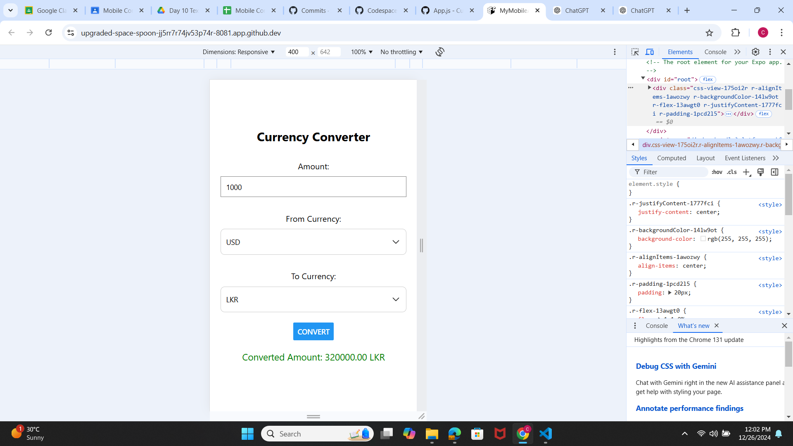

# React Native Currency Converter App

This React Native project is a **Currency Converter** app that enables users to easily convert between multiple currencies (USD, LKR, EUR) using predefined conversion rates. It offers a user-friendly interface with dropdown menus for currency selection, allowing for quick and interactive conversions.

---

## Key Features

1. **Currency Conversion**  
   - Converts between USD, LKR, and EUR using predefined conversion rates.

2. **Input Validation**  
   - Ensures the user inputs a valid, numeric amount before proceeding.

3. **Interactive Dropdowns**  
   - Uses `react-native-dropdown-picker` for selecting source and target currencies.

4. **Instant Results**  
   - Displays the converted amount immediately after clicking the **Convert** button.

5. **Error Handling**  
   - Provides error messages when the input is invalid or missing.

---

## Component Overview

### `App.js`  
This is the main component that integrates the app's logic and user interface.

#### **State Variables**
- `amount`: Holds the input value entered by the user.  
- `fromCurrency` & `toCurrency`: Manage the currencies selected by the user.  
- `convertedAmount`: Stores the result of the conversion.  
- `error`: Displays error messages for invalid inputs.  
- `fromCurrencyOpen` & `toCurrencyOpen`: Control the visibility of dropdown menus.

#### **Functionality**
1. **Currency Conversion Logic**  
   - Validates user input (ensures it's numeric).  
   - Fetches the correct conversion rate based on the selected currencies.  
   - Calculates the converted value and displays it or shows an error.

2. **Dropdown Menus**  
   - Users can select "from" and "to" currencies using interactive dropdown menus.

#### **UI Components**
- **TextInput**: For entering the amount to convert.  
- **Dropdowns**: For selecting currencies with `react-native-dropdown-picker`.  
- **Button**: Initiates the conversion when clicked.  
- **Text**: Displays either the converted amount or an error message.

---

## App Workflow

1. **User Input**  
   - User types in the amount they wish to convert.

2. **Currency Selection**  
   - User selects the source currency and the target currency from dropdown menus.

3. **Conversion**  
   - On clicking the "Convert" button, the app validates the input, performs the conversion, and updates the output.

4. **Display Result**  
   - The converted amount is shown on the screen, or an error message is displayed if the input is invalid.

---

## Styling Details

- **Main Container**  
  - Utilizes `flexbox` to center content on the screen.  
  - A clean, white background with padding for a neat presentation.

- **Input Field**  
  - Styled with borders for better clarity and usability.

- **Dropdown Menus**  
  - Styled using `react-native-dropdown-picker` for a seamless dropdown experience.

- **Result/Error Text**  
  - The result is shown in green, while errors are displayed in red to grab the user’s attention.

---

## Expected Output

